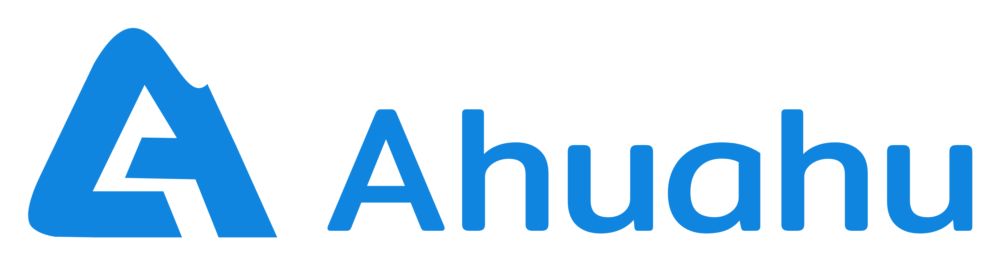

<!--
*** Thanks for checking out the Best-README-Template. If you have a suggestion
*** that would make this better, please fork the repo and create a pull request
*** or simply open an issue with the tag "enhancement".
*** Thanks again! Now go create something AMAZING! :D
-->

<!-- PROJECT SHIELDS -->
<!--
*** I'm using markdown "reference style" links for readability.
*** Reference links are enclosed in brackets [ ] instead of parentheses ( ).
*** See the bottom of this document for the declaration of the reference variables
*** for contributors-url, forks-url, etc. This is an optional, concise syntax you may use.
*** https://www.markdownguide.org/basic-syntax/#reference-style-links
-->

[![Contributors][contributors-shield]][contributors-url]
[![Forks][forks-shield]][forks-url]
[![Stargazers][stars-shield]][stars-url]
[![Issues][issues-shield]][issues-url]
[![MIT License][license-shield]][license-url]

<!-- PROJECT LOGO -->

 

  
  
  <h3 align="center">Ahuahu App</h3>

  

    A sports recommendation application using machine learning methods based on air quality at the location!
     
    <a href="https://github.com/MohammadFebriyanto/ahuahu_app"><strong>Explore the docs »</strong></a>
     
     
    <a href="#!">View Demo</a>
    ·
    <a href="https://github.com/MohammadFebriyanto/ahuahu_app/issues">Report Bug</a>
    ·
    <a href="https://github.com/MohammadFebriyanto/ahuahu_app/issues">Request Feature</a>
  

<!-- TABLE OF CONTENTS -->

  
Table of Contents

  <ol>
    <li>
      <a href="#about-the-project">About The Project</a>
      <ul>
        <li><a href="#built-with">Built With</a></li>
      </ul>
    </li>
    <li>
      <a href="#getting-started">Getting Started</a>
      <ul>
        <li><a href="#prerequisites">Prerequisites</a></li>
        <li><a href="#installation">Installation</a></li>
      </ul>
    </li>
    <li><a href="#usage">Usage</a></li>
    <li><a href="#roadmap">Roadmap</a></li>
    <li><a href="#contributing">Contributing</a></li>
    <li><a href="#license">License</a></li>
    <li><a href="#contact">Contact</a></li>
    <li><a href="#acknowledgements">Acknowledgements</a></li>
  </ol>

<!-- ABOUT THE PROJECT -->
## About The Project

</img>
</img>
</img>
</img>

There are many great README templates available on GitHub, however, I didn't find one that really suit my needs so I created this enhanced one. I want to create a README template so amazing that it'll be the last one you ever need -- I think this is it.

Here's why:
* Your time should be focused on creating something amazing. A project that solves a problem and helps others
* You shouldn't be doing the same tasks over and over like creating a README from scratch
* You should element DRY principles to the rest of your life :smile:

Of course, no one template will serve all projects since your needs may be different. So I'll be adding more in the near future. You may also suggest changes by forking this repo and creating a pull request or opening an issue. Thanks to all the people have have contributed to expanding this template!

A list of commonly used resources that I find helpful are listed in the acknowledgements.

### Built With

For Android Development :
* [Android Studio](https://developer.android.com/studio)
* [Kotlin](https://developer.android.com/kotlin)
* [MVVM Architecture](https://developer.android.com/jetpack/guide)
* [Retrofit2](https://square.github.io/retrofit/)
* [Dagger-Hilt Dependency Injection](https://dagger.dev/hilt/)
* [Room Database](https://developer.android.com/jetpack/androidx/releases/room)
* [Lottie](https://github.com/airbnb/lottie-android)

For Machine Learning :

For Cloud Computing :

<!-- GETTING STARTED -->
## Getting Started

This is an example of how you may give instructions on setting up your project locally.
To get a local copy up and running follow these simple example steps.

### Prerequisites

This app only can run on Android smartphone (Stable for Android 7+)

### Installation

1. Download the app from releases
2. Install the app on your device
3. Open it

## Usage

Use this space to show useful examples of how a project can be used. Additional screenshots, code examples and demos work well in this space. You may also link to more resources.

_For more examples, please refer to the [Documentation](https://example.com)_

<!-- ROADMAP -->
## Roadmap

See the [open issues](https://github.com/MohammadFebriyanto/ahuahu_app/issues) for a list of proposed features (and known issues).

<!-- CONTRIBUTING -->
## Contributing

Contributions are what make the open source community such an amazing place to be learn, inspire, and create. Any contributions you make are **greatly appreciated**.

1. Fork the Project
2. Create your Feature Branch (`git checkout -b feature/AmazingFeature`)
3. Commit your Changes (`git commit -m 'Add some AmazingFeature'`)
4. Push to the Branch (`git push origin feature/AmazingFeature`)
5. Open a Pull Request

<!-- LICENSE -->
## License

Distributed under the MIT License. See `LICENSE` for more information.

<!-- CONTACT -->
## Contact

Your Name - [@your_twitter](https://twitter.com/your_username) - email@example.com

Project Link: [https://github.com/your_username/repo_name](https://github.com/your_username/repo_name)

<!-- ACKNOWLEDGEMENTS -->
## Acknowledgements
* [GitHub Emoji Cheat Sheet](https://www.webpagefx.com/tools/emoji-cheat-sheet)
* [Img Shields](https://shields.io)
* [Choose an Open Source License](https://choosealicense.com)
* [GitHub Pages](https://pages.github.com)
* [Animate.css](https://daneden.github.io/animate.css)
* [Loaders.css](https://connoratherton.com/loaders)
* [Slick Carousel](https://kenwheeler.github.io/slick)
* [Smooth Scroll](https://github.com/cferdinandi/smooth-scroll)
* [Sticky Kit](http://leafo.net/sticky-kit)
* [JVectorMap](http://jvectormap.com)
* [Font Awesome](https://fontawesome.com)

## Special Thanks To

<!-- MARKDOWN LINKS & IMAGES -->
<!-- https://www.markdownguide.org/basic-syntax/#reference-style-links -->
[contributors-shield]: https://img.shields.io/github/contributors/MohammadFebriyanto/ahuahu_app.svg?style=for-the-badge
[contributors-url]: https://github.com/MohammadFebriyanto/ahuahu_app/graphs/contributors
[forks-shield]: https://img.shields.io/github/forks/MohammadFebriyanto/ahuahu_app.svg?style=for-the-badge
[forks-url]: https://github.com/MohammadFebriyanto/ahuahu_app/network/members
[stars-shield]: https://img.shields.io/github/stars/MohammadFebriyanto/ahuahu_app.svg?style=for-the-badge
[stars-url]: https://github.com/MohammadFebriyanto/ahuahu_app/stargazers
[issues-shield]: https://img.shields.io/github/issues/MohammadFebriyanto/ahuahu_app.svg?style=for-the-badge
[issues-url]: https://github.com/MohammadFebriyanto/ahuahu_app/issues
[license-shield]: https://img.shields.io/github/license/MohammadFebriyanto/ahuahu_app.svg?style=for-the-badge
[license-url]: https://github.com/MohammadFebriyanto/ahuahu_app/blob/master/LICENSE.txt
[product-screenshot]: assets/screenshot_1.jpg
